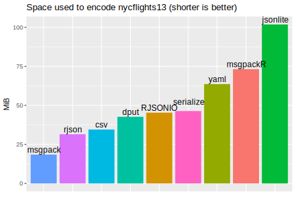
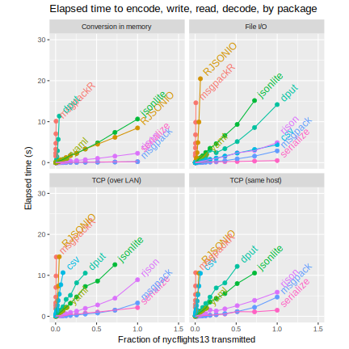

[](https://cran.r-project.org/package=msgpack)
[](https://travis-ci.org/crowding/msgpack-r)
[](https://codecov.io/gh/crowding/msgpack-r)


This is a high speed [msgpack](https://msgpack.org) encoder
and decoder for R, based on the [CWPack](https://github.com/clwi/CWPack) C
implementation.

`msgpack` is a binary data format with data structures similar to
`JSON` and a compact binary encoding. It can be a drop-in replacement
for `JSON` in most applications. It is designed to be fast to parse
and compact to transmit and store.

```{R echo=FALSE}
knitr::opts_chunk$set(collapse=TRUE)
```

## Installation

From CRAN:

```{R eval=FALSE}
install.packages("msgpack")
```

From Github:

```{R eval=FALSE}
library(devtools)
install_github("crowding/msgpack-r")
```

## Usage

```{R}
library(msgpack)
x <- packMsg( list(compact=TRUE, schema=0) )
x
dput(unpackMsg( x ))
```

### Connections / Streaming

Write messages one or several at a time:

```{r}
conOut <- rawConnection(raw(0), open = "w") # or socketConnection, etc
writeMsg("one", conOut)
writeMsgs(list(2, c(buckle=TRUE), c(owner="my", type="shoe")), conOut)
```

Use a `msgConnection` object to read messages one or several at a time:

```{r}
conIn <- msgConnection(rawConnection(rawConnectionValue(conOut), open = "r"))
dput(readMsgs(conIn, 2))
dput(readMsg(conIn))
dput(readMsgs(conIn))
```

### Performance

Msgpack is fast and compact. See the [benchmarking vignette](inst/doc/comparison.html).




